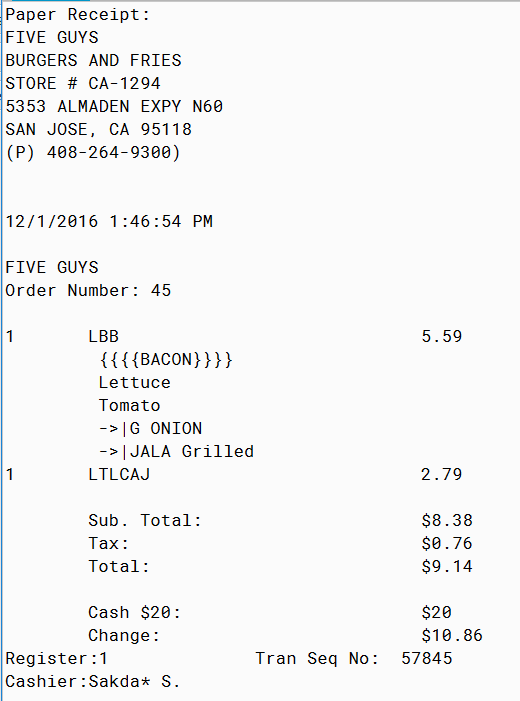
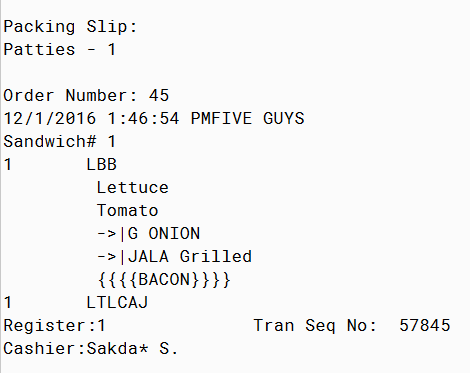

#### How I implement my design pattern:

1. ##### Composite design pattern

   I used the composite design pattern to build order, creating order similar to the tree structure, so I chose the composite design pattern. In this design pattern, I define a Component interface, all component(Bacon,Lettuce,Tomato,Gonion,JalaGrilled,Fries) implements the Component interface. And I also create a Composite class that implements the Component interface. Then the BuildOrder class uses the Composite class to add or remove components.

2. ##### Strategy design pattern

   I used the Strategy design pattern for printing bill. In this design pattern, I defined a BillStrategy interface. Both receipt types (Paper Receipt and Packing Slip) implement the printBill method in the BillStrategy interface. And I create a BillContext class for printing selection, so we can choose to print Paper Receipt or Packing Slip.

#### Demo output screenshot:

> > - ##### Paper Receipt:
> >
> >   
> >
> > - ##### Packing Slip
> >
> >   